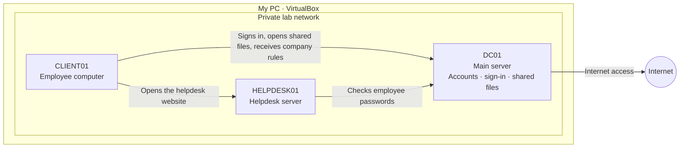
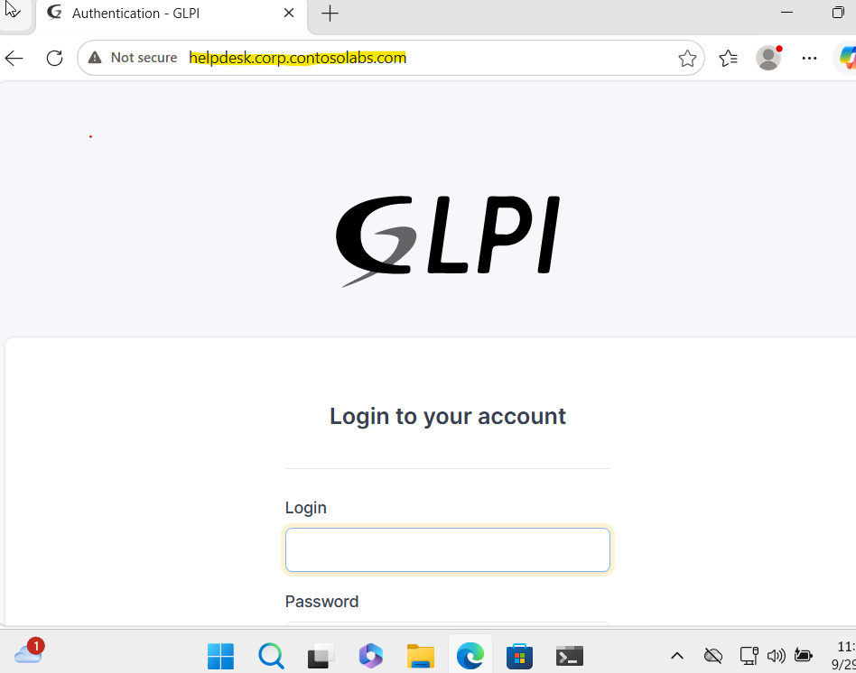
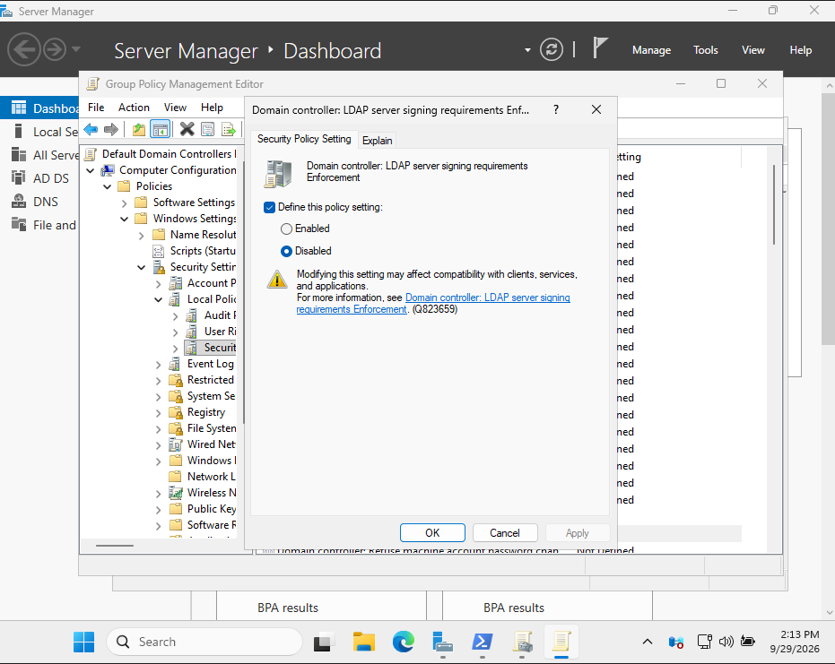
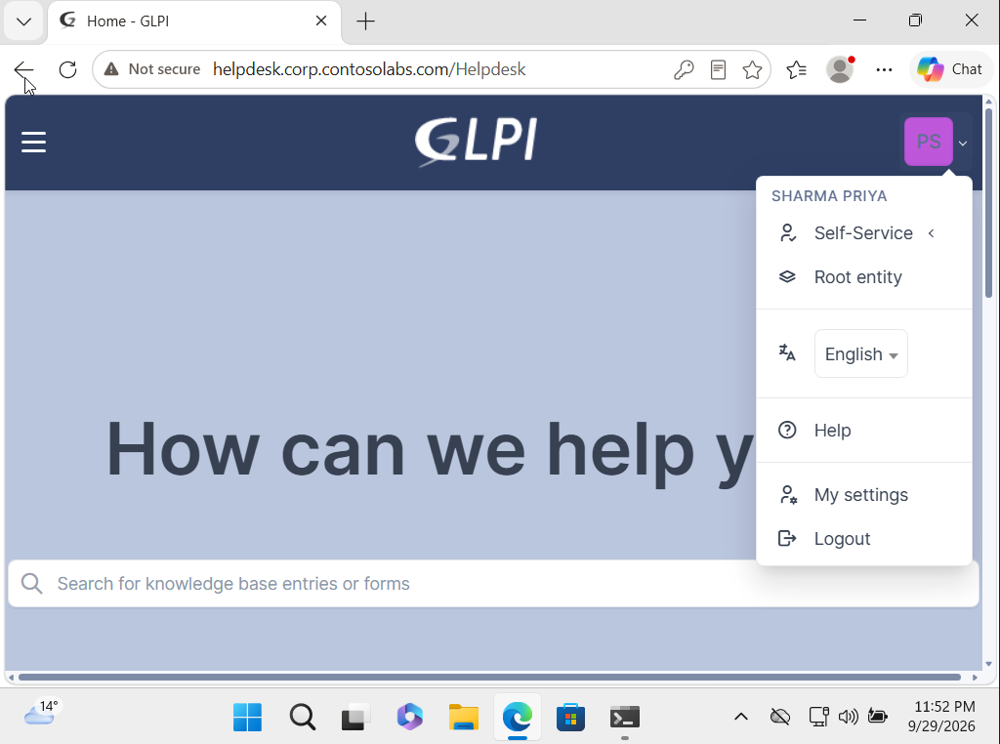
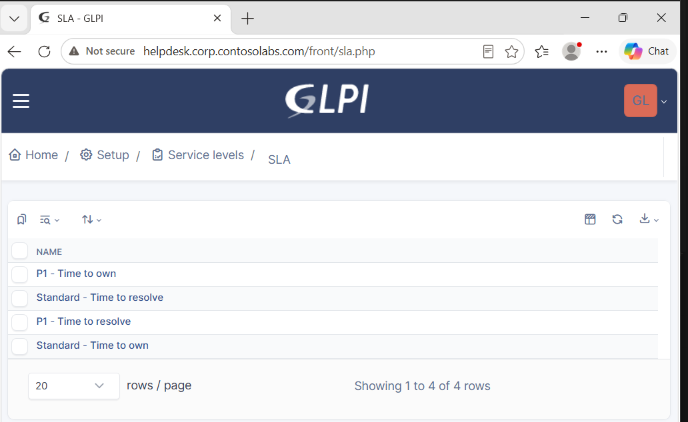
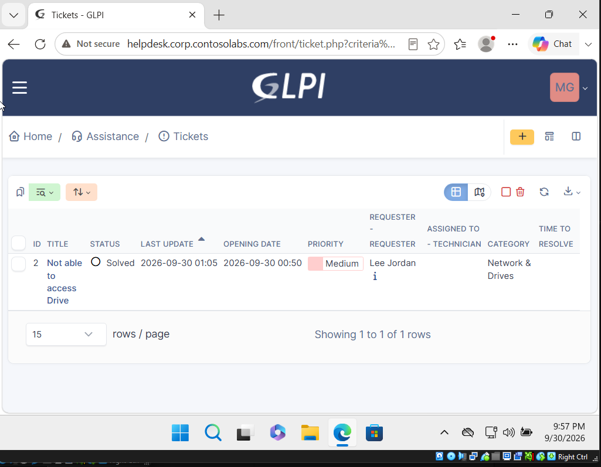

# Corporate IT Helpdesk Lab

I built this lab to get real, hands-on practice with the work an IT support analyst does every day. It recreates a small, made-up company called **Contoso Labs**, with me as its only IT person. I set up the company's employee accounts and computer rules, then built a helpdesk where staff can log in and ask for help.

Everything runs on my own PC in VirtualBox, using free trial and open-source software.

## Highlights

- Set up a company network from scratch on Windows Server 2025, with employees organized by department
- Created company-wide password and lockout rules, plus department-specific settings such as a shared Finance drive
- Kept admin access separate from everyday accounts, so powerful permissions are only used when they're needed
- Built a helpdesk website where employees sign in with their normal work password to submit tickets
- Set response and resolution targets that only count business hours
- Made a deliberate security trade-off for the lab, and documented how I'd handle it properly in a real company

## Project phases

| Phase | What it covers | Status |
|---|---|---|
| **Phase 1** | Setting up the company network: employee accounts, departments, and computer rules | ✅ Complete |
| **Phase 2** | Building a helpdesk ticketing system | ✅ Complete |

## How the lab is set up



| Machine | What it runs | What it does |
|---|---|---|
| DC01 | Windows Server 2025 | The main server. It stores every employee account, checks passwords when people sign in, and hosts the shared Finance folder. |
| CLIENT01 | Windows 11 | A typical employee computer, used to see exactly what staff see. |
| HELPDESK01 | Ubuntu Linux | Runs the helpdesk website. |

The company network is called `corp.contosolabs.com`, and the helpdesk lives at `http://helpdesk.corp.contosolabs.com`.

## Skills practised

Windows Server · Active Directory · Group Policy · DNS · file and folder permissions · PowerShell · Windows 11 support · account lockouts and password resets · Linux (Ubuntu) · Docker · LDAP · GLPI ticketing · SLAs

---

## Phase 1: Setting up the company network

### 1.1 The main server

I installed Windows Server 2025 and turned it into the company's main server, known as a domain controller. It holds every employee account and checks their password whenever they sign in to a company computer. It also acts as the company's address book (DNS), so computers can find each other by name instead of by number.

### 1.2 Organizing the company

Instead of putting every account in one place, I organized them the way the company is actually structured, with a folder for each department. That makes it easy to give each team its own settings. Admin accounts get their own folder, kept apart from regular staff.

```
corp.contosolabs.com
└── Contoso
    ├── Admin Accounts
    ├── Computers
    ├── Disabled Users
    ├── Groups           GRP-IT · GRP-Sales · GRP-Finance · GRP-HR
    └── Users
        ├── Finance
        ├── HR
        ├── IT
        └── Sales
```

Each department also has a matching group, such as GRP-Finance. When someone needs access to something, I add them to the right group instead of setting up access person by person. A new hire simply joins their department's group and gets everything their team uses.


### 1.3 Adding employees

Rather than creating accounts one by one, I listed the employees in a spreadsheet (a CSV file) and used PowerShell to create them all at once. Each person lands in their department's folder and group automatically, and has to choose their own password the first time they sign in. If I run it again after adding new hires, it skips anyone who already has an account.

### 1.4 Keeping admin access separate

Every Windows network comes with a built-in "Administrator" account, and attackers know it's there. So I created my own named admin account and use it only for admin work. Every change can be traced back to a specific person, and the account can be switched off without affecting anything else. Because admin accounts live in their own folder, they're also kept out of systems that don't need them, like the helpdesk in Phase 2.

### 1.5 Company rules (Group Policy)

Group Policy lets me set a rule once on the server and have it apply automatically to the right people.

| Rule | Applies to | What it does |
|---|---|---|
| Password and lockout rules | Everyone | Sets password requirements and locks accounts after too many wrong guesses |
| Finance shared drive | Finance team | Adds the Finance folder to their computer as drive F: |
| Sales restrictions | Sales team | Blocks Control Panel and Settings so computers can't be changed by accident |

**The password rules**

| Rule | Setting |
|---|---|
| Length and strength | At least 12 characters, mixing letters, numbers, and symbols |
| No reusing old passwords | The last 24 passwords can't be used again |
| How often passwords change | Every 42 days |
| Too many wrong guesses | 5 wrong passwords locks the account for 10 minutes |
| Built-in Administrator | Can also be locked out, so nobody can keep guessing its password |

The password rules cover the whole company. The department rules follow the person, so they apply on whichever company computer that person signs in to.


### 1.6 Who can open the Finance folder

Windows checks two sets of permissions before letting someone into a shared folder: one for connecting to it over the network, and one for the files inside. I gave the Finance group access in both places, so Finance staff can open, edit, and save files, while everyone else is turned away.

### 1.7 Testing it as an employee

I connected a Windows 11 computer to the company network and signed in as different employees to make sure each rule worked the way it should:

| What I tested | Signed in as | What happened |
|---|---|---|
| Signing in with a work account | Priya (Finance) | Signed in with her work password |
| The Finance drive | Priya (Finance) | The F: drive appeared on its own |
| The Finance drive for other teams | Jordan (Sales) | No F: drive, and he couldn't open the Finance folder |
| The Sales restrictions | Jordan (Sales) | Control Panel and Settings were blocked |
| The Sales restrictions for other teams | Priya (Finance) | Control Panel and Settings opened normally |


### 1.8 Everyday helpdesk tasks

I practised the requests a helpdesk hears most often:

| What the employee says | What I did |
|---|---|
| "I'm locked out of my computer" | Found the locked account and unlocked it |
| "I forgot my password" | Set a temporary password that they have to change the next time they sign in |

**Example:** Jordan typed the wrong password five times and got locked out, just like a real employee might on a busy Monday morning. On the server, I searched for locked accounts, found his, and unlocked it so he could sign back in.


---

## Phase 2: Building a helpdesk

Phase 2 gives employees a place to report problems and follow their progress, and gives IT staff a queue to work through. I used GLPI, a free, open-source helpdesk tool used by many organizations. Employees log in with the same username and password they use on their computer, so there's nothing new to remember.

### 2.1 The helpdesk server

I set up a separate Linux server (Ubuntu) for the helpdesk and gave it a fixed address on the network. GLPI runs in Docker, which packages the app and its database into ready-made containers, so it's quick to install and easy to rebuild. I also gave it a friendly web address, `helpdesk.corp.contosolabs.com`, so nobody has to remember a number.

GLPI comes with a few built-in accounts that have well-known default passwords, so I changed those straight away.



### 2.2 Signing in with work accounts

I connected GLPI to the main server so it can check employees' usernames and passwords, using LDAP, the standard way apps talk to Windows accounts. Three decisions shaped how it works:

**A dedicated helper account.** GLPI uses its own account, `svc-glpi`, to look people up. It's an ordinary account with no special permissions, because looking up names doesn't need any. Its password is set not to expire, so the connection doesn't suddenly stop working one day.

**Only employees can sign in.** GLPI only looks at the employee folders, so admin accounts and helper accounts can't be used to log in to the helpdesk.

**A security trade-off I made on purpose.** Newer Windows servers require extra protection on these sign-in checks by default, and that blocked GLPI from connecting. Because this lab is sealed off on a private network, I switched that requirement off. In a real company, I'd leave it on and set up an encrypted connection (LDAPS) instead.



### 2.3 Who can do what

| Account | Access level | Used for |
|---|---|---|
| `glpi` | Full admin, stored inside GLPI itself | Setting up the helpdesk, and as a backup way in |
| IT staff (for example, Maria) | Technician | Working on tickets |
| Employees (for example, Priya) | Self-service | Submitting and following their own tickets |

I kept one admin login that doesn't depend on the main server. If the main server ever goes offline, I can still get into the helpdesk to sort things out.



### 2.4 Response times that respect business hours

Every ticket gets two targets: how quickly someone picks it up, and how quickly it gets fixed.

| Type of ticket | Picked up within | Fixed within |
|---|---|---|
| Urgent (P1) | 30 minutes | 4 hours |
| Standard | 4 hours | 2 days |

The clock only runs Monday to Friday, 9 AM to 5 PM, just like a real IT team's hours. A standard ticket opened at 4 PM on a Friday with 4 hours to go isn't overdue that evening. It's due at noon on Monday.



### 2.5 A ticket from start to finish

1. The employee logs in to the helpdesk with their work account and describes the problem.
2. They can check on the ticket at any time from their own list.
3. The ticket shows up in the IT queue with its priority and who reported it, ready for someone to pick up.

**Example:** Jordan from Sales reported that he couldn't open a network drive. The ticket was filed under **Network & Drives**, marked as medium priority, worked on, and closed as solved.



---

## What's in this repository

```
corporate-it-helpdesk-lab/
├── README.md
└── docs/
    └── screenshots/
        ├── phase1/    Setting up the company network
        └── phase2/    Building the helpdesk
```

## Notes

Contoso Labs is a made-up company, and every employee name is fictional. The lab runs on a private network on my own computer, using free trial versions of Windows and open-source tools. No real passwords or secrets are stored here.

## About me

**Bhavneet Singh Rajpal** · [LinkedIn](https://linkedin.com/in/bhavneetsrajpal)
