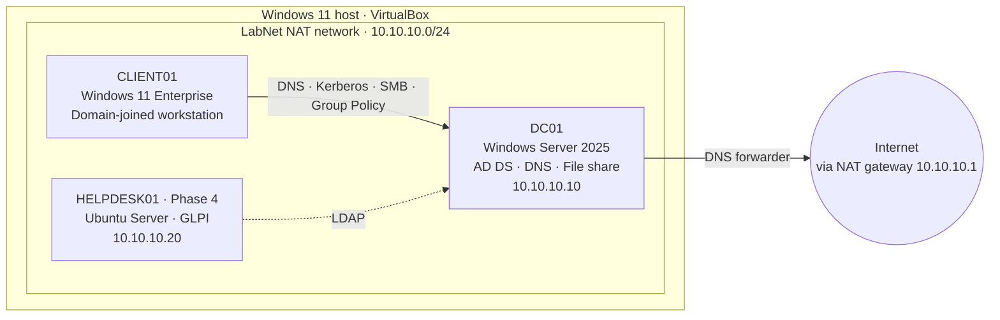
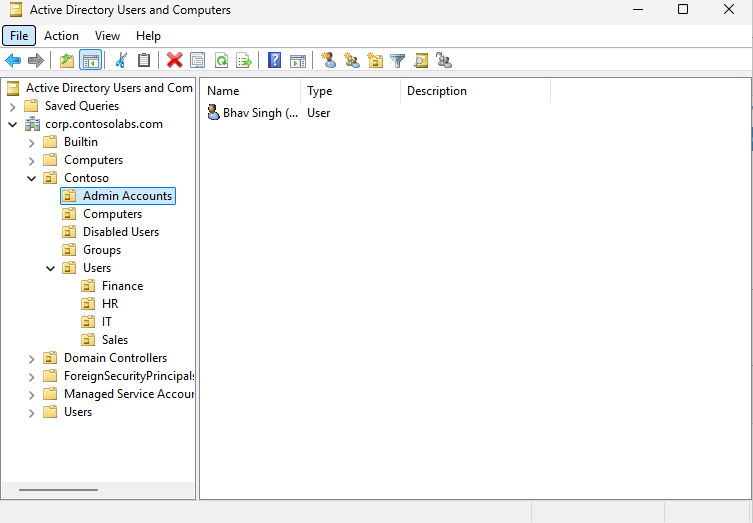
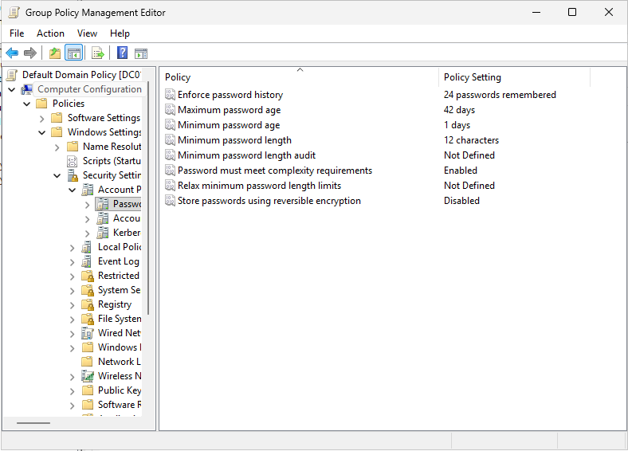
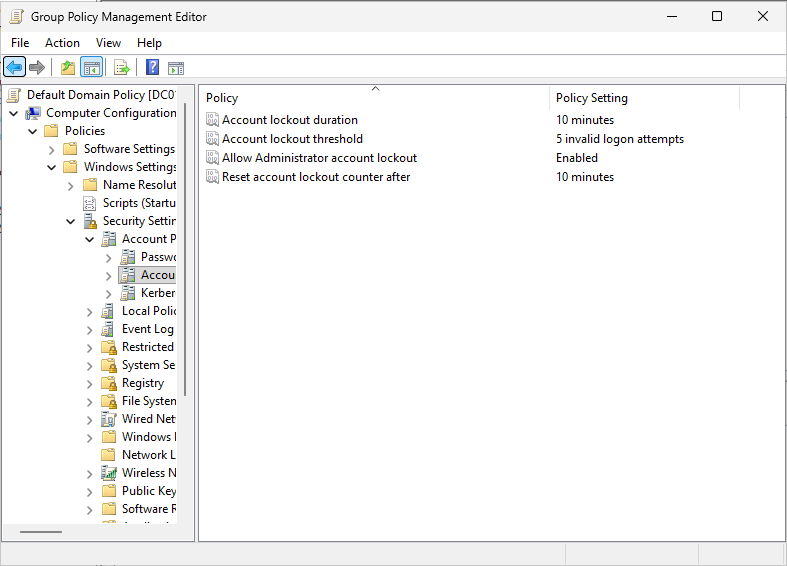
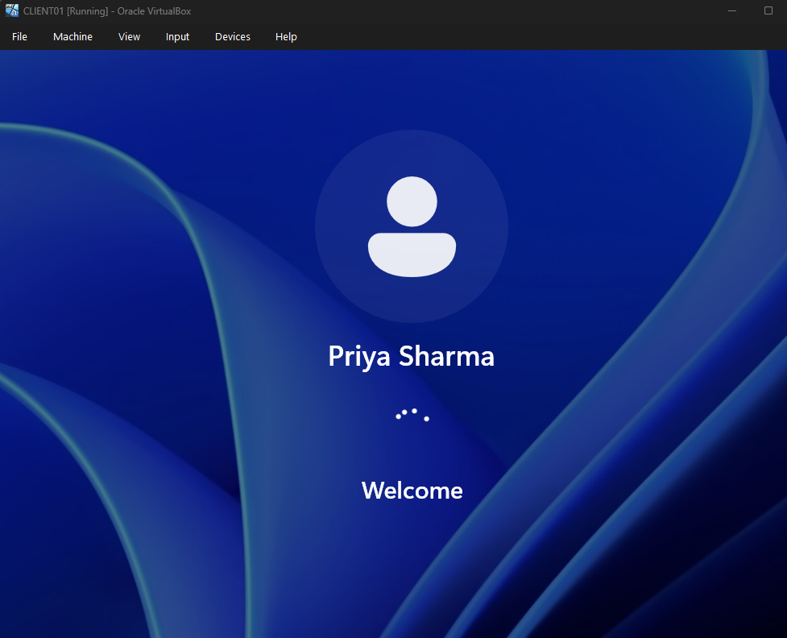
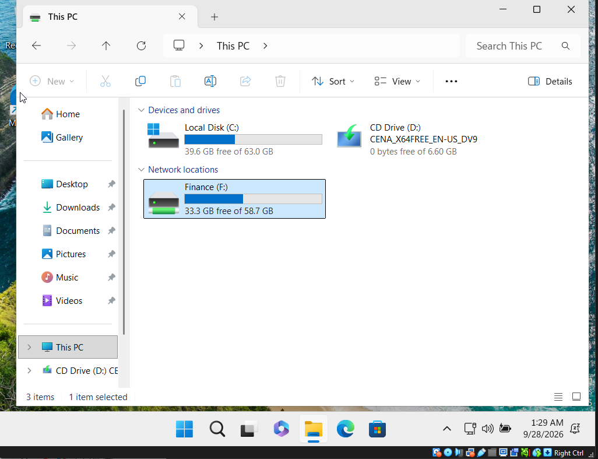
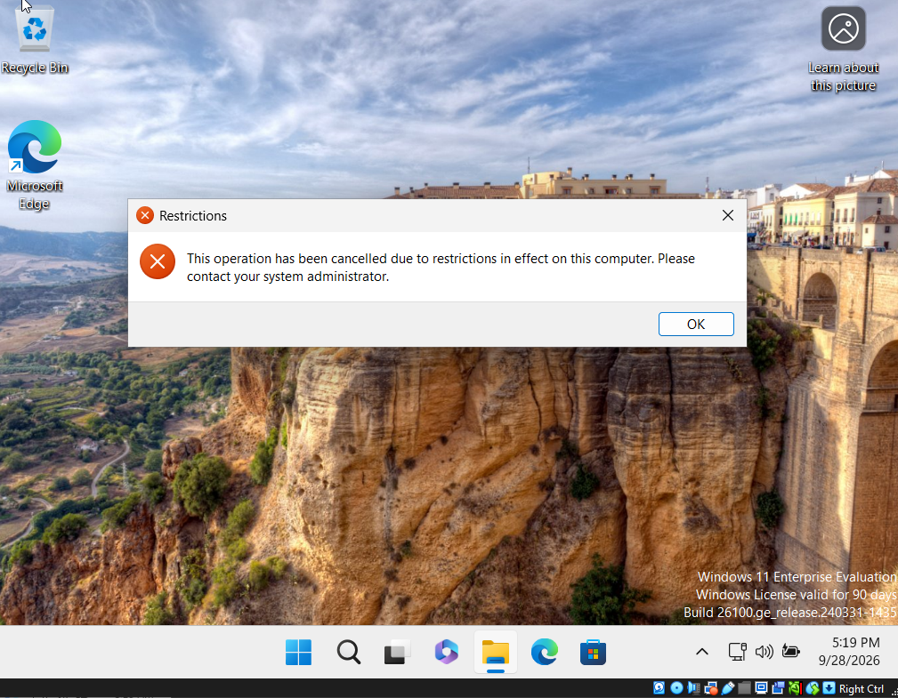
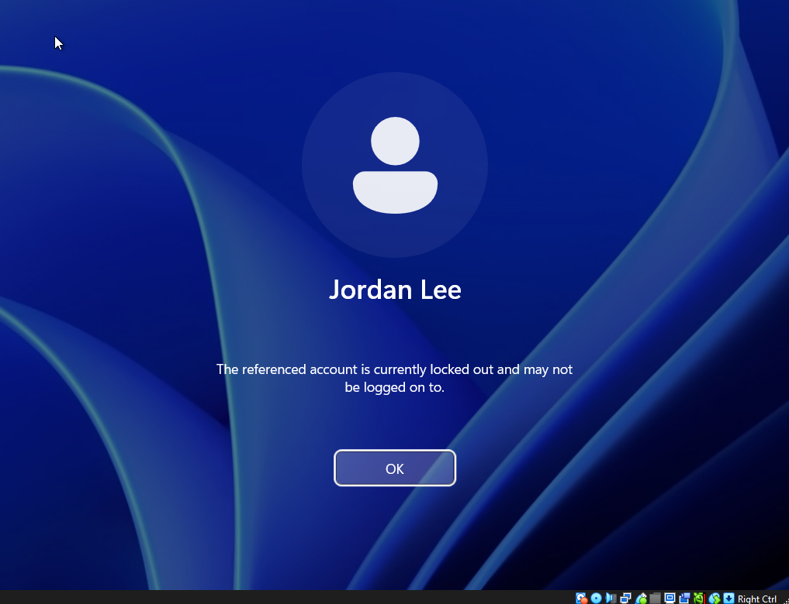
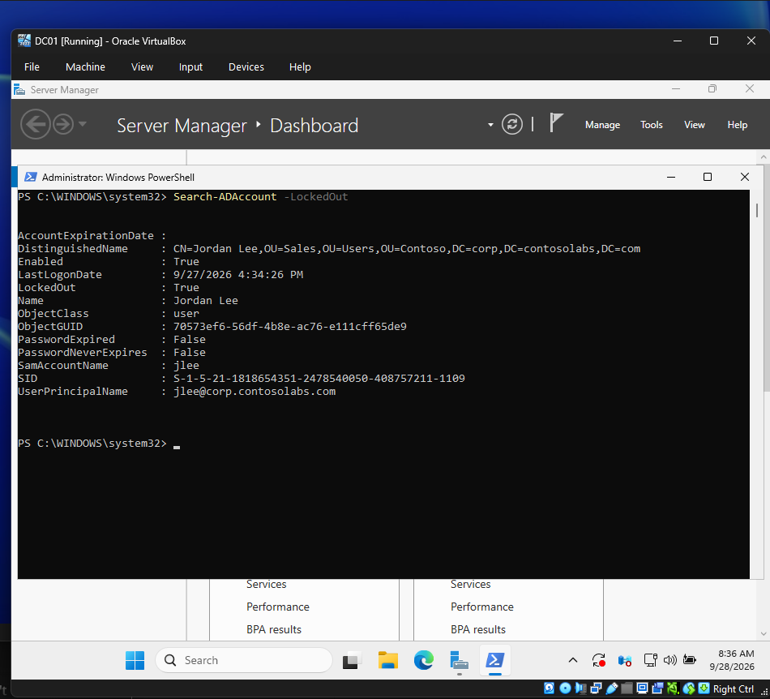

# Corporate IT Helpdesk Lab

A hands-on home lab that simulates the IT environment of a small company, **Contoso Labs**, where I act as the sole IT administrator. The goal is to practise the day-to-day work of an IT Support Analyst: managing identities and devices with Active Directory and Group Policy, running a ticket queue against SLAs, tracking hardware assets, and automating repetitive admin tasks.

Every component runs on evaluation or open-source software inside VirtualBox.

## Project roadmap

| Phase | Focus | Status |
|---|---|---|
| **Phase 1** | Active Directory, DNS, Group Policy, file share permissions, domain-joined workstation | ✅ Complete |
| **Phase 4** | Ticketing and asset management with GLPI (LDAP authentication, SLAs, automatic inventory) | 🔄 In progress |
| **Phase 5** | Automation of onboarding and offboarding workflows | ⏳ Planned |

## Lab architecture



| Machine | Operating system | Role |
|---|---|---|
| DC01 | Windows Server 2025 Standard (Desktop Experience) | Domain controller, DNS server, file server |
| CLIENT01 | Windows 11 Enterprise | Domain-joined employee workstation |
| HELPDESK01 | Ubuntu Server LTS | GLPI helpdesk and asset management (Phase 4) |

| Setting | Value |
|---|---|
| Domain | `corp.contosolabs.com` |
| NetBIOS name | `CONTOSO` |
| Network | `10.10.10.0/24`, gateway `10.10.10.1` |

## Skills demonstrated

Active Directory administration · DNS · Group Policy (security settings, preferences, administrative templates) · share and NTFS permissions · least-privilege admin accounts · PowerShell automation · domain join and policy validation · account lockout and password reset workflows · user offboarding

---

## Phase 1: Active Directory and Group Policy

### 1.1 Domain controller

DC01 was configured with a static IP address, renamed, and promoted to the first domain controller of a new forest, `corp.contosolabs.com`, with Active Directory–integrated DNS. After promotion, DC01 points DNS at itself and forwards external lookups to a public resolver so domain members can reach the internet.


### 1.2 Organizational unit design

The directory is organised around the company rather than the default containers, so that Group Policy can be targeted by department and privileged accounts stay separate from regular users.

```
corp.contosolabs.com
└── Contoso
    ├── Admin Accounts
    ├── Computers
    ├── Disabled Users
    ├── Groups           GRP-IT · GRP-Sales · GRP-Finance · GRP-HR
    └── Users
        ├── Finance
        ├── HR
        ├── IT
        └── Sales
```

Each department has a matching global security group with a `GRP-` prefix. Permissions are always granted to groups, never to individual users, so access changes are made by editing group membership.




### 1.3 User provisioning

Employees are bulk-provisioned from a CSV file with PowerShell. Each user is created in their department OU, added to their department group, and required to change their password at first sign-in. Existing users are skipped, so the import can be safely re-run after new hires are added to the CSV.


### 1.4 Privileged access

Day-to-day administration uses a dedicated, named admin account instead of the built-in Administrator account. The named account sits in its own **Admin Accounts** OU (shown in the screenshot above) and is a member of Domain Admins.

This follows the principle of least privilege: the built-in Administrator is a well-known target, a named account ties every change in the logs to a specific person, and it can be disabled without affecting the rest of the domain. Keeping admin accounts in a separate OU also means they can be excluded from any future cloud synchronisation scope.


### 1.5 Group Policy

| GPO | Linked to | What it does |
|---|---|---|
| Default Domain Policy | Domain | Password and account lockout policy (below) |
| Finance - Drive Map | Finance OU | Maps `\\DC01\Finance` as drive **F:** for Finance users (Group Policy Preferences) |
| Sales - Restrictions | Sales OU | Blocks access to Control Panel and the Settings app for Sales users |

**Password and lockout policy**

| Setting | Value |
|---|---|
| Minimum password length | 12 characters |
| Password complexity | Required |
| Password history | 24 passwords remembered |
| Maximum / minimum password age | 42 days / 1 day |
| Account lockout threshold | 5 invalid sign-in attempts |
| Lockout duration and counter reset | 10 minutes |
| Administrator account lockout | Allowed, so the built-in Administrator is also protected against password guessing |

Password and lockout settings are configured in the Default Domain Policy because domain account policies only take effect when linked at the domain level. Department policies use **User Configuration**, so they follow the user to any domain-joined computer they sign in to.






### 1.6 File share permissions

The Finance share uses two permission layers:

| Layer | Principal | Permission |
|---|---|---|
| Share | GRP-Finance | Change |
| NTFS | GRP-Finance | Modify (inherited by all subfolders and files) |

Effective access is the more restrictive of the two layers, so only Finance group members can open the share, and they can read, write, and delete files within it.


### 1.7 Workstation domain join and policy validation

CLIENT01 was joined to the domain and placed in the **Computers** OU. Each policy was then validated by signing in as users from different departments:

| Test | User | Expected result |
|---|---|---|
| Domain sign-in | psharma (Finance) | Signs in to CLIENT01 with her AD credentials |
| Finance drive mapping | psharma (Finance) | F: drive appears in File Explorer |
| Drive mapping scope | jlee (Sales) | No F: drive; direct access to `\\DC01\Finance` is denied |
| Control Panel restriction | jlee (Sales) | Control Panel and Settings are blocked |
| Restriction scope | psharma (Finance) | Control Panel and Settings open normally |

Applied policies were confirmed with `gpresult /r` for each user.








### 1.8 Helpdesk operations

Common helpdesk requests were practised against the live domain, both in Active Directory Users and Computers and in PowerShell:

| Helpdesk scenario | Action taken |
|---|---|
| "I'm locked out of my computer" | Found the locked account and unlocked it |
| "I forgot my password" | Set a temporary password and required a change at next sign-in |
| Employee departure | Disabled the account, removed group memberships, and moved it to Disabled Users |

**Example: account lockout.** Five incorrect passwords for Jordan Lee triggered the lockout policy on CLIENT01. On DC01, the locked account was identified with `Search-ADAccount -LockedOut` and then unlocked.






## Notes

Contoso Labs is a fictional company and all user data is made up. The lab runs on an isolated VirtualBox NAT network using Microsoft evaluation software. No passwords, secrets, or tenant identifiers are stored in this repository.

## Author

**Bhavneet Singh Rajpal** · [LinkedIn](https://linkedin.com/in/bhavneetsrajpal)
